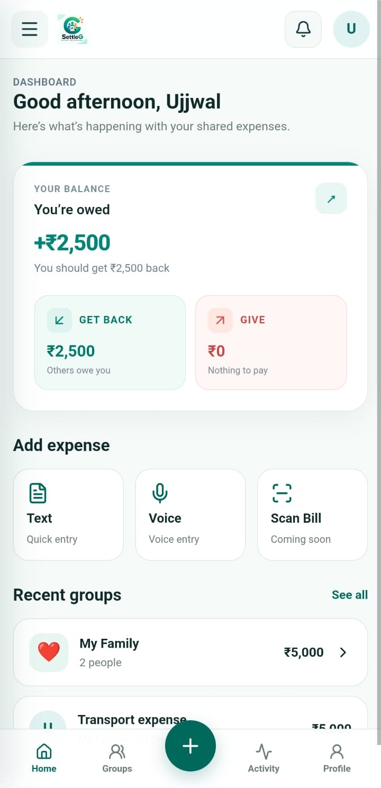
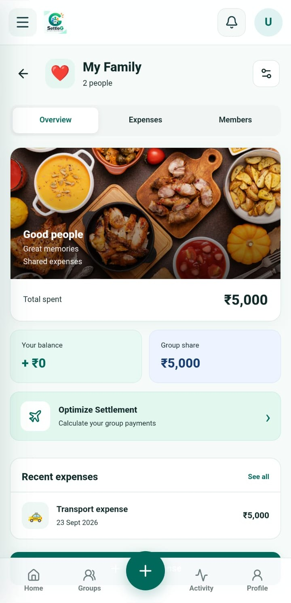
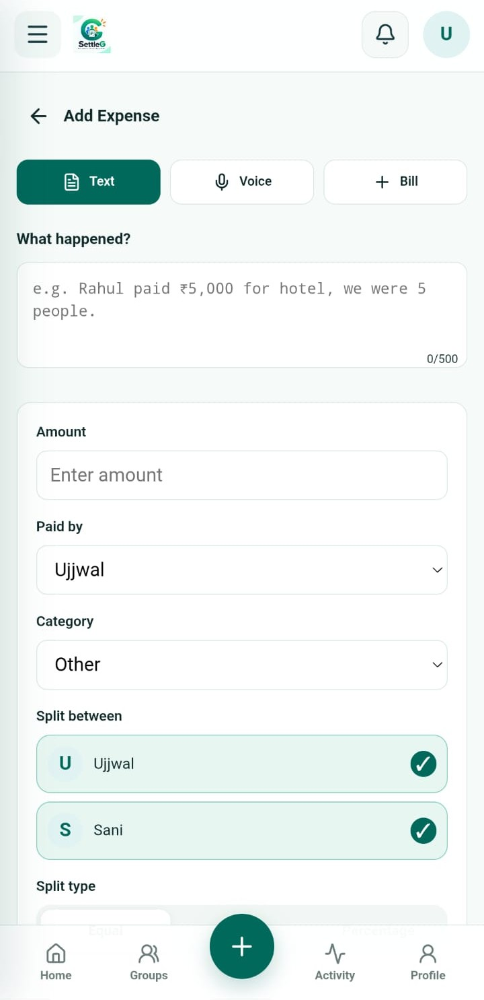
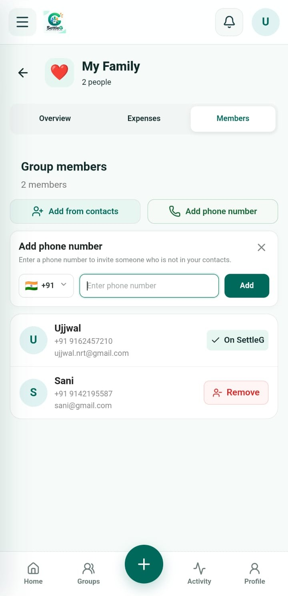

# SettleG

A modern group expense-splitting app for managing shared expenses, balances, and settlements with friends, family, or groups.

## Live Demo

https://settle-frontend-iota.vercel.app

## Problem It Solves

Managing shared expenses through WhatsApp messages, notes, or spreadsheets can become confusing when multiple people pay for different things.

SettleG solves this by bringing **expenses, members, splitting, balances, and settlements into one place**.

Instead of manually calculating who owes whom, users can simply add an expense, choose how it should be split, and let SettleG handle the calculations.

## Features

- Create and manage expense groups
- Add, edit, and delete expenses
- Equal, exact amount, percentage & share-based splitting
- Smart expense entry using natural text
- Track balances and settlements
- Invite members by phone number
- Group activity tracking
- Responsive web & Android app
- Toast notifications and loading states

## Tech Stack

- React
- Vite
- React Router
- TanStack React Query
- JavaScript / JSX
- CSS
- Lucide React
- Capacitor
- Node.js / Express
- Supabase / PostgreSQL

## Architecture

```text
React / Capacitor
       ↓
Node.js / Express
       ↓
Supabase
       ↓
PostgreSQL
```

## Screenshots

<p align="center">
  
  
   
   
</p>


## Expense Splitting

SettleG supports:

- **Equal:** Split equally between members
- **Exact:** Assign specific amounts
- **Percentage:** Split by percentage
- **Shares:** Split using share units

## Author

**Ujjwal**

Built with ❤️ using React, Node.js, Supabase & Capacitor.
